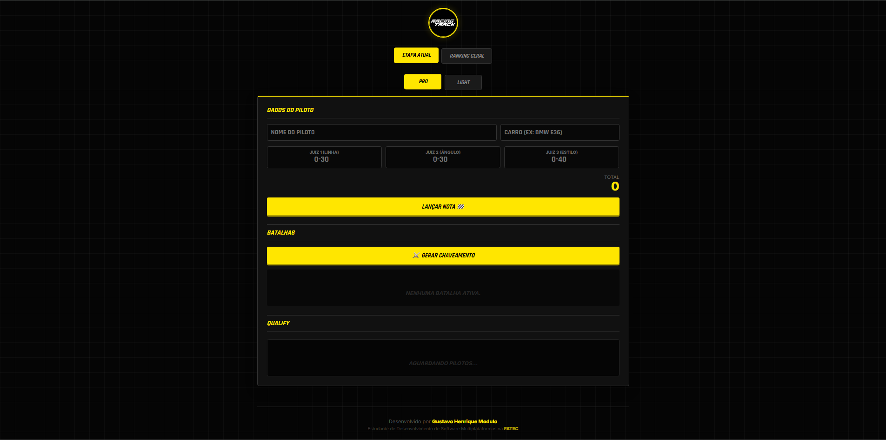
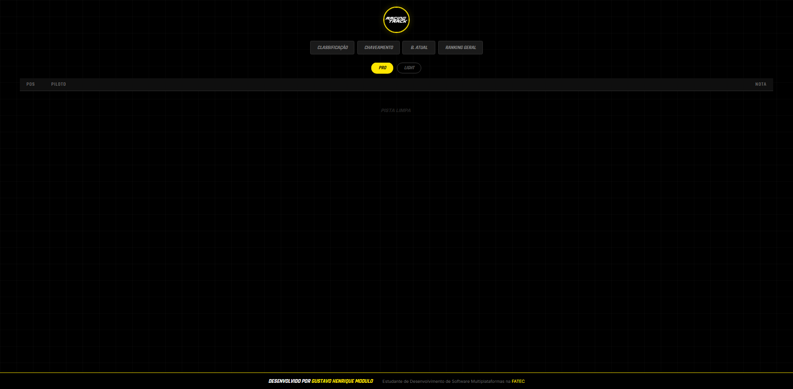

# 🏁 Racing Track Manager


> **Sistema de Gestão e Transmissão em Tempo Real para Campeonatos de Drift.**

Este projeto é uma aplicação web desenvolvida para gerenciar eventos automobilísticos (focados em Drift), permitindo o controle de notas, geração automática de chaves de batalha (brackets) e transmissão ao vivo dos resultados para o público via telas/telões.

---

## 📸 Galeria do Projeto

| Painel Administrativo | Tela do Público (Ao Vivo) |
|:---------------------:|:-------------------------:|
| *Interface de controle de notas e chaves* | *Transmissão em tempo real e ranking* |
|  |  |

---

## 🚀 Funcionalidades

### 🔧 Painel Administrativo (`admin.html`)
* **Gestão de Pilotos:** Cadastro de pilotos e carros com divisão por categorias (**PRO** e **LIGHT**).
* **Sistema de Notas:** Cálculo automático de notas de qualificação baseada em 3 critérios (Linha, Ângulo e Estilo).
* **Algoritmo de Chaveamento:** Geração automática de batalhas (Top 32, Top 16, etc.) baseada no rank de qualificação (Seeds: 1 vs 32, 2 vs 31...).
* **Controle de Batalhas:** Definição de vencedores e gerenciamento de OMT (One More Time).
* **Pontuação da Temporada:** Cálculo e atribuição automática de pontos para o ranking geral do campeonato.

### 📺 Tela do Público / TV (`live.html`)
* **Updates em Tempo Real:** Utiliza **WebSockets (via Supabase)** para atualizar a tela instantaneamente quando o juiz lança uma nota ou define um vencedor, sem necessidade de recarregar a página.
* **Visualização de Qualify:** Tabela de classificação dinâmica.
* **Visualização de Chaves:** Árvore de torneio interativa.
* **Batalha Atual:** Destaque em tela cheia para o confronto que está acontecendo.

### 💾 Extras
* **Exportação de Imagens:** Funcionalidade para baixar prints das tabelas e chaves em PNG para divulgação em redes sociais (usando `html2canvas`).
* **Persistência de Dados:** Todos os dados são salvos na nuvem via **Supabase**.

---

## 🛠️ Tecnologias Utilizadas

* **Frontend:** HTML5, CSS3 (CSS Grid & Flexbox), JavaScript (ES6+).
* **Backend as a Service (BaaS):** [Supabase](https://supabase.com/) (PostgreSQL Database & Realtime Subscriptions).
* **Bibliotecas:**
  * `supabase-js` (Conexão com banco de dados).
  * `html2canvas` (Geração de imagens).

---

## 📂 Estrutura do Projeto

```text
racing-track-manager/
│
├── admin.html        # Interface de controle (Juízes/Diretor de Prova)
├── live.html         # Interface de transmissão (Telão/TV)
│
├── css/
│   └── style.css     # Estilização global e responsividade
│
├── js/
│   ├── admin.js      # Lógica de CRUD, cálculos e gestão de estado
│   └── live.js       # Lógica de atualização em tempo real (Listeners)
│
│
├── screenshots/
│   ├── admin.png        # Print da tela de ADMIN.
│   └── live.png        # Print da tela de LIVE/PÚBLICO.
│
│
└── README.md         # Documentação do projeto
